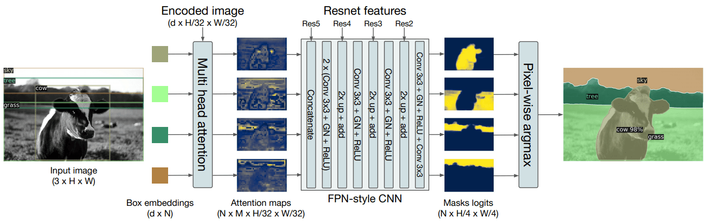

# EVA 6 Phase-1 Capstone Part 1

As a part of the CAPSTONE project you need to explain missing:
* We take the encoded image (dxH/32xW/32) and send it to Multi-Head Attention (**FROM WHERE DO WE TAKE THIS ENCODED IMAGE?**)
* We also send dxN Box embeddings to the Multi-Head Attention
* We do something here to generate NxMxH/32xW/32 maps. (**WHAT DO WE DO HERE?**)
* Then we concatenate these maps with Res5 Block (**WHERE IS THIS COMING FROM?**)



* Then we perform the above steps (**EXPLAIN THESE STEPS**)
* And then we are finally left with the panoptic segmentation


FROM WHERE DO WE TAKE THIS ENCODED IMAGE?
-------------------

These encoded images are from obtained a CNN bakbone (*model ki Ridh Ki Haddi*), DeTr uses pretrained ResNet achitecture as backbone (*Ridh Ki Haddi*). ResNet creates a highe order representation of the imput image which extract important features and then these features map are send to multi head attention along with bounding box embeddings. But why a backbone is needed in transformers? VIT worked well on image classification? But here we solving a object detection and segmentation problem and transformers are good at manupulating 1D data and these problems requies 2D data thats why we reqiure a CNN  backbone (*Ridh Ki Haddi*).


WHAT DO WE DO HERE?
-----------------

This function is written under `class MHAttentionMap:` in [DeTr's model file](https://github.com/facebookresearch/detr/blob/master/models/segmentation.py) whcih is used to generate features map.
```
def forward(self, q, k, mask: Optional[Tensor] = None):
        q = self.q_linear(q)
        k = F.conv2d(k, self.k_linear.weight.unsqueeze(-1).unsqueeze(-1), self.k_linear.bias)
        qh = q.view(q.shape[0], q.shape[1], self.num_heads, self.hidden_dim // self.num_heads)
        kh = k.view(k.shape[0], self.num_heads, self.hidden_dim // self.num_heads, k.shape[-2], k.shape[-1])
        weights = torch.einsum("bqnc,bnchw->bqnhw", qh * self.normalize_fact, kh)

        if mask is not None:
            weights.masked_fill_(mask.unsqueeze(1).unsqueeze(1), float("-inf"))
        weights = F.softmax(weights.flatten(2), dim=-1).view(weights.size())
        weights = self.dropout(weights)
        return weights
```
Basically we are taking the encoder and decoder output from multi head attention, these are considered as quaires and keys respectively, these quaries and keys are passed through linear layer and a conv layer to generate better quaires and keys and reshaped. The decoder output is transposed and multiplied by encoder output with `torch.einsum` to generate  (NxMxH/32xW/32) then mask is applied over these weights and these weights are passed through a sofmax layer to generate activation maps.


WHERE IS THIS COMING FROM?
-------------------

These activation maps are now passed through a FPN style CNN for upscaling. DeTr uses four convolutional layers to upscale, in each layer the output fronm the resnet backbone is added. Resnet has 5 block we take the output of last four blocks and then add them one by one after passing the activation maps through cnn layer andthen group normalization is applied 

This function is written under `class MaskHeadSmallConv:` in [DeTr's model file](https://github.com/facebookresearch/detr/blob/master/models/segmentation.py) 

```
def forward(self, x: Tensor, bbox_mask: Tensor, fpns: List[Tensor]):
        x = torch.cat([_expand(x, bbox_mask.shape[1]), bbox_mask.flatten(0, 1)], 1)

        x = self.lay1(x)
        x = self.gn1(x)
        x = F.relu(x)
        x = self.lay2(x)
        x = self.gn2(x)
        x = F.relu(x)

        cur_fpn = self.adapter1(fpns[0])
        if cur_fpn.size(0) != x.size(0):
            cur_fpn = _expand(cur_fpn, x.size(0) // cur_fpn.size(0))
        x = cur_fpn + F.interpolate(x, size=cur_fpn.shape[-2:], mode="nearest")
        x = self.lay3(x)
        x = self.gn3(x)
        x = F.relu(x)

        cur_fpn = self.adapter2(fpns[1])
        if cur_fpn.size(0) != x.size(0):
            cur_fpn = _expand(cur_fpn, x.size(0) // cur_fpn.size(0))
        x = cur_fpn + F.interpolate(x, size=cur_fpn.shape[-2:], mode="nearest")
        x = self.lay4(x)
        x = self.gn4(x)
        x = F.relu(x)

        cur_fpn = self.adapter3(fpns[2])
        if cur_fpn.size(0) != x.size(0):
            cur_fpn = _expand(cur_fpn, x.size(0) // cur_fpn.size(0))
        x = cur_fpn + F.interpolate(x, size=cur_fpn.shape[-2:], mode="nearest")
        x = self.lay5(x)
        x = self.gn5(x)
        x = F.relu(x)

        x = self.out_lay(x)
        return x
```

EXPLAIN THESE STEPS
------------------

- The input image is passed through a ResNet50 backbone, it encodes the image to higher dimentional features to be processed by multihead attention layers. The output of each last four block of resnet is kept, the final output of resnet is of shape (h/32,w/32,2048).
- The encoded image is processed to dimension of (h/32*w/32,256) and passed to multi head attention block which consists of a encoder and decoder block.
- The activation maps generated after the multihead attention of shape (NxMxH/32xW/32) are passed through a FPN style CNN to upscale the mask
- The final result is passed to pixel wise argmax to generate the final segmentation mask output


How are you going to solve this problem.
--------------------


